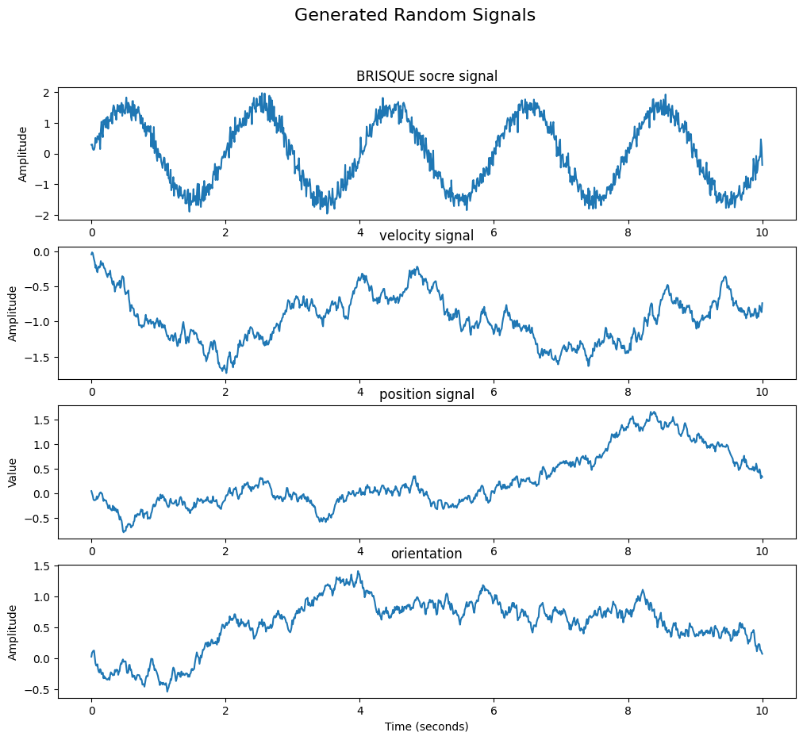

# Time series anomaly detection

In this documentation I am going to indicate some ways of detecting anomaly detection on time series.

In this scenario, we have several robots (e.g. 5) and each of them receives some signals such as velocity, acceleration, `BRISQUE`, and so on, in this case we consumed that there are 4 signals.

All these robots have an image sensor, our goal is to detect which robot, receives degraded image, so that we can enhance this image.

the quality of an image is measured by the `BRISUQE` criteria. At each frame we calculate the BRISQUE, and when we do this for several frames, we will come up with a signal in the time domain.

since the data acquisition is not trivial, I used hypothesis signals:




the methods that can be considered for this task are:

- `One-Class SVM`: A support vector machine (SVM) model trained to classify data points as normal or outliers.

- `Moving Averages`: Identifying anomalies based on deviations from the moving average or exponential moving average.

- `Seasonal Decomposition`: Decomposing a time series into its trend, seasonal, and residual components, with anomalies often detected in the residual component.

I chose the first the method since it seems it is more compatible in this task and can detect anomaly data better than other methods.

In order to apply One-class svm, first I converted each signal to its characteristics.

It means, the input signals with the shape of (#n_robots, #n_signals, #timesteps), which is (5, 4, 1000) in here, were converted to (5, 4, 9).

The characteristics of each signal were considered as some features such as mean, std, max, min, median, quantiles, and so on.

It makes the code more efficient to work with lower dimension signal. However, the code were also tested on the original signal too. 

after that, since we want to find the robot which receives anomaly signal, we should apply the svm method on all sensors (dim = 1), and store the anomaly score of each signal. 

then we do a summation on the scores of each robot and the robot with the lowest score, is likely to produce the anomaly signal.


This approached worked on the made up signals, how ever it should be tested in the real environment. 


The code snippets to produce the signal and adding anomaly to it is:


```
sample = np.random.randn(4, 4, 1000)
anomal_signal = np.ones((1, 4, 1000)) * 50
```

in this case we considered the last robot is producing the anomaly signal, and the results on the converted signal are as below:

```
array([ 9.99930955,  9.99704093,  9.99522959, 10.00020699,  4.0194087 ])
```
as you can see the last robot has the lowest score, which means it produces the anomaly.

Also the result of the code on the original signal (without converting the signal) are as below:

```
array([9.97136819, 9.97051646, 9.97053041, 9.97143647, 4.01944092])
```